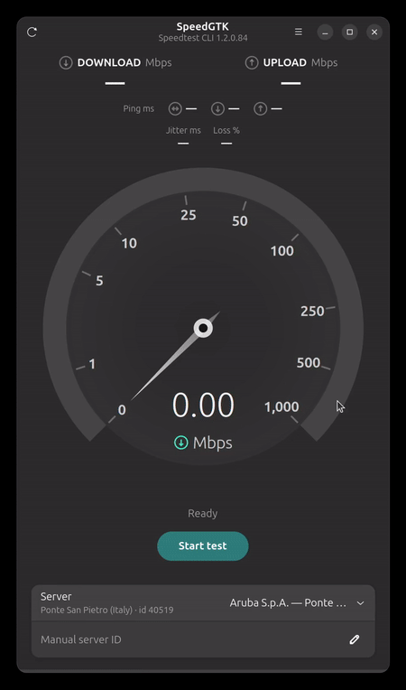
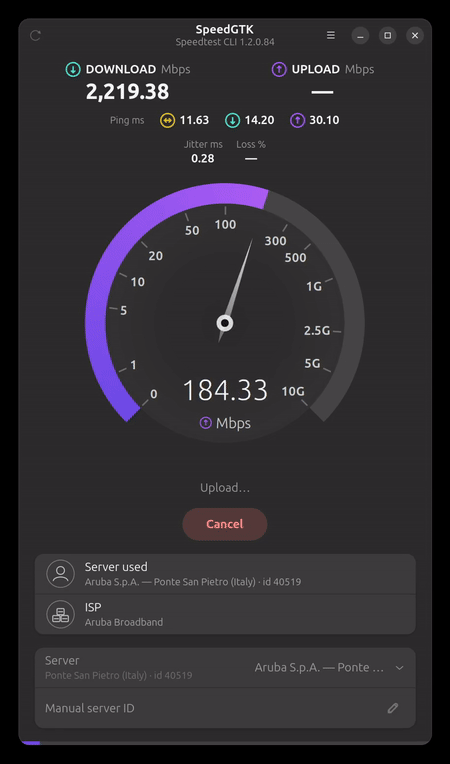
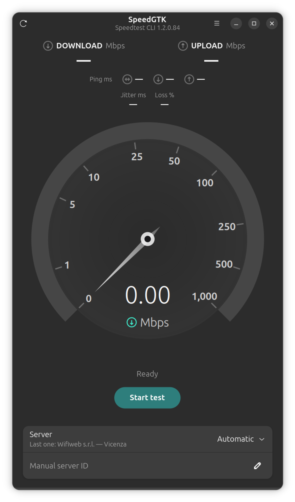
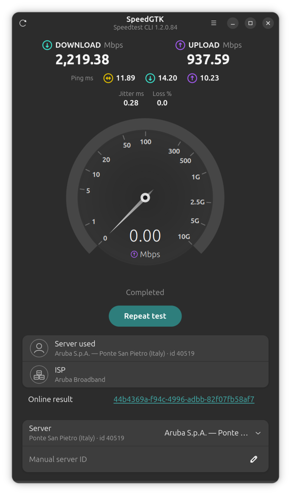
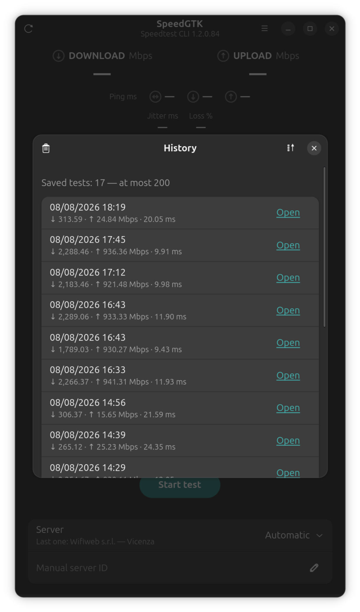
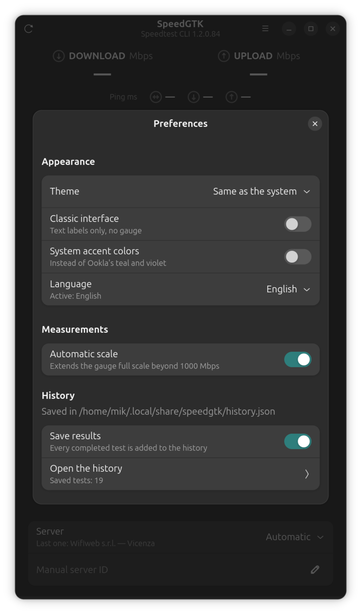

# SpeedGTK

<p align="center">
  
</p>

SpeedGTK is a native GTK 4 and libadwaita interface for the official [Ookla
Speedtest CLI](https://www.speedtest.net/apps/cli), **inspired by the official
Windows and Mac apps made by Ookla**. It brings download, upload,
idle/download/upload latency, jitter and packet-loss measurements into a modern
GNOME application.

## Features & Highlights

- Live speed gauge with extended multi-gigabit scale.
- Curated animations and icons for a sleek interface.
- Support for a simpler, classic interface.
- Idle, download and upload latency, plus jitter and packet loss.
- Server selection and a manual server ID.
- Local history with sorting by date, download, upload, ping or weighted
  overall result.
- Light, dark and system theme options; follows the GNOME accent color when
  enabled.
- Interface available in English, Italian, German, Spanish, French and
  Russian.

## Screenshots & Demos (from v1.6)

### Live demos

<table>
  <tr>
    <th>Download</th>
    <th>Upload</th>
  </tr>
  <tr>
    <td>
      <br>
      <a href="docs/media/download-demo.mp4">Download MP4</a>
    </td>
    <td>
      <br>
      <a href="docs/media/upload-demo.mp4">Download MP4</a>
    </td>
  </tr>
</table>

### Screenshots

<table>
  <tr>
    <td></td>
    <td></td>
  </tr>
  <tr>
    <td align="center"><sub>Ready</sub></td>
    <td align="center"><sub>Result</sub></td>
  </tr>
  <tr>
    <td></td>
    <td></td>
  </tr>
  <tr>
    <td align="center"><sub>History</sub></td>
    <td align="center"><sub>Settings</sub></td>
  </tr>
</table>

## Requirements

- Linux with GTK 4 and libadwaita.
- Python 3 with PyGObject bindings for GTK 4 and libadwaita.
- The official [Ookla Speedtest CLI](https://www.speedtest.net/apps/cli),
  available as the `speedtest` command.

The application checks the command when it starts. On Debian-derived
distributions it also displays copyable installation commands; other
distributions are directed to Ookla's official installation page.

## Installation

### Install from source (recommended)

Cloning the repository and installing with Make is the recommended way to run
the latest SpeedGTK version. It is also the most reliable option across Linux
distributions; the AppImage is updated only for selected milestone releases.

Clone the repository, then install SpeedGTK with:

```bash
git clone https://github.com/mikpinky/speedgtk.git
cd speedgtk
sudo make install
```

Launch **SpeedGTK** from the application menu or run `speedgtk`.

To update an existing installation, pull the latest changes and run the same
install command again. To uninstall it:

```bash
sudo make uninstall
```

System-wide removal preserves the user's history and preferences. It only
resets the stored acceptance of the Ookla terms, which will be requested again
if SpeedGTK is reinstalled.

### AppImage

The AppImage is tested on **Ubuntu 26.04** and is intended for reasonably
modern Linux desktops running **GNOME 50 or newer**. Compatibility with other
distributions is not guaranteed; if it does not work, installing from source
is the recommended solution.

Download `SpeedGTK-2.0-x86_64.AppImage` from the
[GitHub release](https://github.com/mikpinky/speedgtk/releases/tag/v2.0), then
make it executable and launch it:

```bash
chmod +x SpeedGTK-2.0-x86_64.AppImage
./SpeedGTK-2.0-x86_64.AppImage
```

The AppImage does not include Ookla Speedtest CLI. The external `speedtest`
command must still be installed separately and available in `PATH`.

### Install for one user

A local installation without administrator privileges remains available:

```bash
make install-user
```

Remove it with:

```bash
make uninstall-user
```

Unlike system-wide removal, `make uninstall-user` also deletes SpeedGTK's
saved history, preferences and stored Ookla terms acceptance.

## Development

Run the syntax checks and test suite with:

```bash
make check
```

Run the application directly from the source tree with:

```bash
make run
```

The Python package uses a conventional `src/` layout. See
[`docs/architecture.md`](docs/architecture.md) for module responsibilities and
dependency rules.

Translations are stored in [`po/`](po/). The project intentionally depends on
the official Ookla CLI rather than the unrelated Python `speedtest-cli`
utility, whose output format is incompatible with this application.

## Ookla notice

SpeedGTK is an independent project and is not affiliated with, endorsed by or
sponsored by Ookla. It does not bundle the Speedtest CLI: each user installs
the official command separately. On first launch, SpeedGTK asks the user to
review and explicitly accept Ookla's [End User License Agreement](https://www.speedtest.net/about/eula),
[Terms of Use](https://www.speedtest.net/about/terms) and
[Privacy Policy](https://www.speedtest.net/about/privacy) before running it.

## Support

Found a bug or have an idea? [Open an issue](https://github.com/mikpinky/speedgtk/issues).

## License

SpeedGTK is released under the [MIT License](LICENSE).
